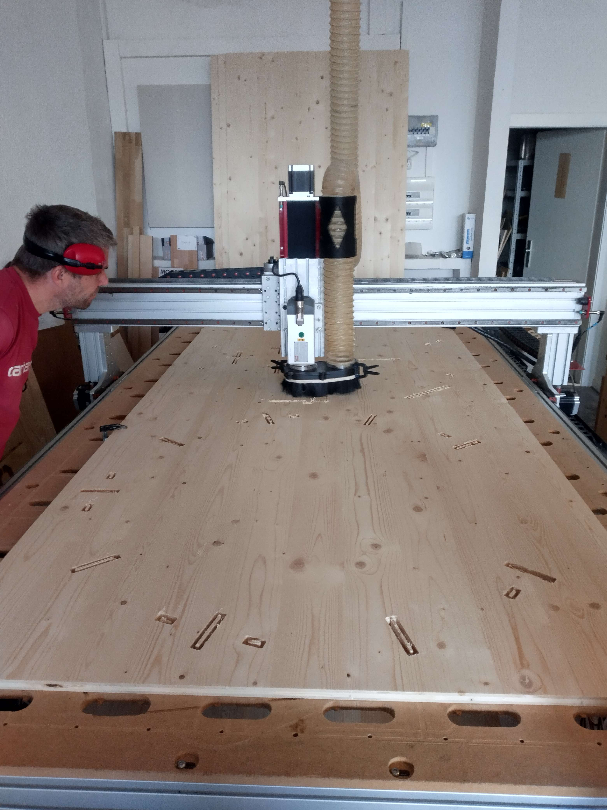
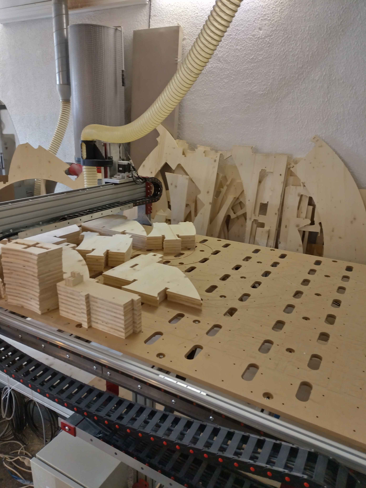

# Growroom
La fabrication d'une [Growroom](https://ikeamuseum.com/en/whats-on/exhibitions/the-growroom/) au [Fablab la Chaux-de-Fonds](https://www.fablab-chaux-de-fonds.ch/), en partenariat avec le [Musée de Neuchâtel](https://www.museum-neuchatel.ch). Ce projet vise à promouvoir l'autosuffisance alimentaire, l'éco-conception et l'utilisation des technologies de fabrication numérique. La Growroom est construite en utilisant des planches de 3 plis de 19 mm (1250 x 2500 mm), un matériau durable et accessible.

# Fabrication
* Fraise 8mm ([SP2FC-D8.0-L22](https://fr.aliexpress.com/item/4000927345057.html?spm=a2g0o.order_list.order_list_main.54.3a045e5bk7h87e&gatewayAdapt=glo2fra))
* Génération de tracé avec [VCarve](https://www.vectric.com/products/vcarve/)
* Design: fichier [DXF](./dxf/)

| | |
|-|-|
|||